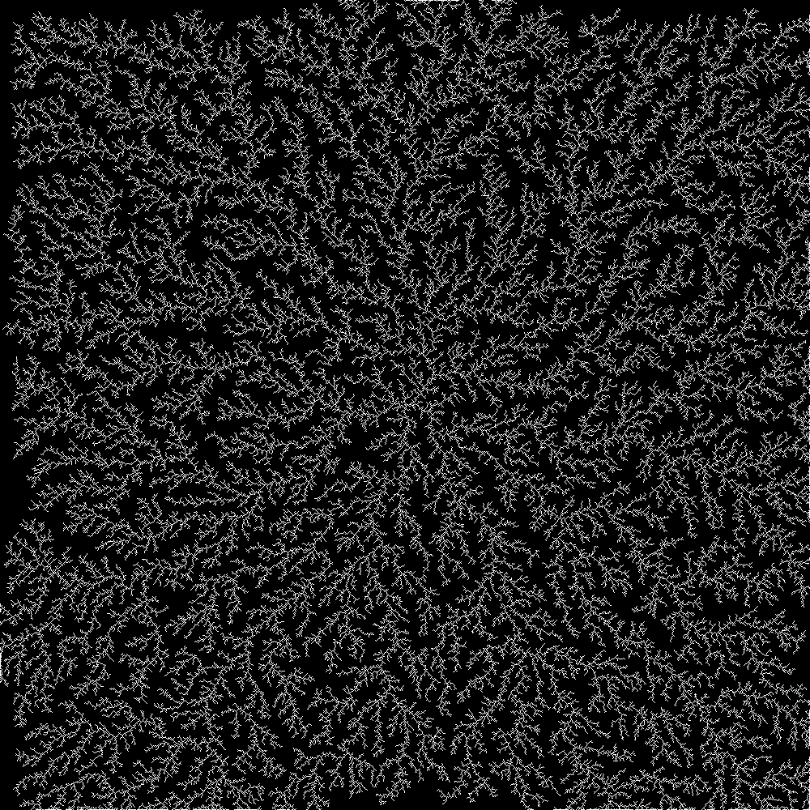

# DLA
Diffusion-limited aggregation in C, written in a serial version and in CUDA and OpenMP for performance.

# USAGE
Build all tree binary by running  
`make`
And the run a version by typing  
`./bin/VERSION_dla WIDTH HEIGHT PARTICLES STEPS CENTER_X CENTER_Y out_map.txt`  
With VERSION being one of [serial, openmp, cuda].  

# OUTPUT
The output of the simulation is a txt file, and can be transformed into an image by running  
`java javautil/Printe.java WIDTH HEIGHT crystal.txt`  
The result is a file crystal.png.  

# DLA

